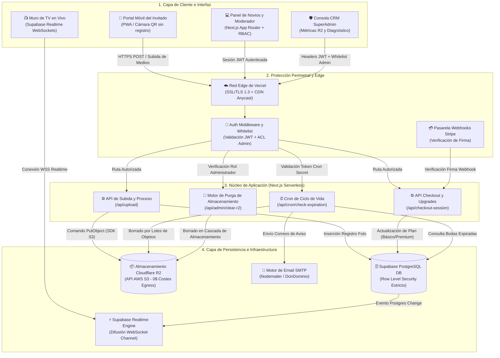
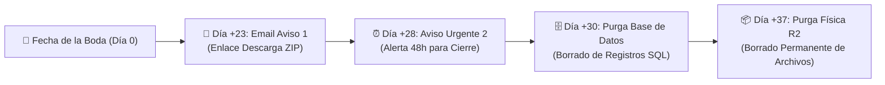

# 💍 Instabodas.es — Caso de Estudio de Arquitectura & Showcase DevSecOps

🌐 **Idioma / Language**: 🇪🇸 Español (Principal) | 🇬🇧 [English Version (README.en.md)](README.en.md)

---

> **Resumen Ejecutivo**:  
> **Instabodas.es** es un SaaS de medios para eventos multitenant de alta disponibilidad diseñado para la captura de fotos en tiempo real por parte de los invitados, proyección en vivo en pantallas/proyectores y gestión integral de bodas. Construido sobre una arquitectura Serverless orientada a eventos, combina almacenamiento de medios sin costes de salida (*zero-egress*) con políticas estrictas de Seguridad a Nivel de Fila (RLS) en PostgreSQL y gobernanza automatizada del ciclo de vida de los datos.

🌐 **Plataforma en Producción**: [instabodas.es](https://instabodas.es)

---

## ✨ Propuesta de Valor Comercial: ¿Qué ofrece InstaBodasQR?

**InstaBodasQR** transforma la experiencia de cualquier boda o evento social en un recuerdo inolvidable, combinando la espontaneidad de los invitados con el control total para los novios.

### 📸 1. Captura Instantánea para Invitados (Sin Fricción)
* **Cero Descargas ni Registros**: Los invitados escanean el código QR en el tarjetón de su mesa e ingresan directamente desde el navegador de su móvil.
* **Subida en Lote & Libro de Firmas Digital**: Permite seleccionar múltiples fotos y vídeos en alta calidad acompañados de felicitaciones personalizadas (hasta 150 caracteres) para el libro de firmas digital.
* **Galería Interactiva & Lightbox**: Visualización fluida con filtros por categorías (*Novios, Banquete, Baile, Otros*) y descarga directa en resolución original.

### 📺 2. Muro en Vivo para TV y Proyectores (Live Slideshow)
* **Proyección en Tiempo Real**: Diseñado para SmartTVs y proyectores durante el banquete o la fiesta.
* **Animaciones al Instante**: Gracias a WebSockets, cada vez que una foto es aprobada en el panel, la pantalla proyecta una alerta animada destacada con la dedicatoria del invitado sin necesidad de recargar.

### 👰 3. Panel de Moderación Inteligente (3 Modos de Control)
* 🟢 **Confianza Total (Automático)**: Publicación inmediata en la galería y en la pantalla de la TV.
* 🟡 **Filtro de Moderación (Manual)**: Las fotos quedan en cola de revisión. Permite generar un **Enlace de Moderador Delegado** (`?mod=...`) para que el Wedding Planner o un amigo modere desde su móvil sin acceso a datos bancarios ni ajustes.
* 🔴 **Modo Sorpresa (Post-Boda)**: Todo lo subido se archiva en secreto. La TV y la galería muestran carteles fijos de agradecimiento hasta que los novios decidan revelar el álbum.

### 📖 4. Libro de Firmas Scrapbook PDF & Descarga ZIP
* **PDF Maquetado Estilo Scrapbook**: Sustituye los listados aburridos por un PDF listo para imprimir que simula un libro físico pegado a mano con fotos polaroid, ligeras rotaciones asimétricas y washi tapes translúcidos.
* **Descarga Completa (.ZIP)**: Empaquetado instantáneo con todas las fotografías aprobadas en calidad original.

### 💌 5. Ecosistema Completo de Wedding Planner (Plan Premium)
* **Invitación Digital Interactiva**: Tarjeta web pública personalizada con foto de los novios, datos bancarios (IBAN) y Bizum.
* **Gestor de Confirmaciones RSVP**: Control detallado de asistencia (adultos, niños, menús especiales, alérgenos, autobús y reserva de hotel).
* **Organizador Visual de Mesas**: Diseñador interactivo de planos con mesas redondas, rectangulares o en U y distribución de sillas.
* **Presupuesto, Proveedores y Música DJ**: Control de gastos/ingresos, agenda de citas y módulo de peticiones de canciones para el DJ con función de veto por los novios.

---

## 🎯 Retos Técnicos y Objetivos Core

El diseño de una plataforma digital para eventos en vivo de alta densidad presenta desafíos de ingeniería complejos: picos repentinos de tráfico, cero fricción para los asistentes, sincronización de pantallas en tiempo real y regulaciones de privacidad estrictas.

### 1. Concurrencia de Alta Ráfaga y Latencia Subsegundo
* **Reto**: Las bodas generan picos intensos de tráfico (100 a 300+ invitados subiendo fotos de alta resolución simultáneamente en una ventana de 3 a 5 horas). Retrasos en la subida o en la pantalla de TV degradan la experiencia.
* **Solución de Arquitectura**: Compresión de imágenes en el cliente y validación previa de metadatos acoplada con subidas asíncronas por fragmentos directamente a almacenamiento en la nube compatible con S3. La proyección en directo en TV consume notificaciones WebSockets de baja latencia de Supabase Realtime (`postgres_changes`), proyectando alertas instantáneas sin sobrecarga de peticiones HTTP polling.

### 2. Aislamiento Multitenant Criptográfico y Privacidad Sin Fricción
* **Reto**: Los invitados deben poder subir fotos y escribir dedicatorias mediante códigos QR sin fricción (sin descargar apps ni registrarse), garantizando al mismo tiempo un aislamiento total entre bodas y protección contra escaneos maliciosos de endpoints.
* **Solución de Arquitectura**: Enrutamiento criptográfico de inquilinos mediante identificadores no enumerables UUID v4 (`/boda/[weddingId]`). La capa de persistencia aplica políticas estrictas de Seguridad a Nivel de Fila (RLS) en PostgreSQL. El control de acceso basado en roles (RBAC) aísla el panel de administración de los novios, las subidas de los invitados, las vistas delegadas para moderadores (`?mod=[weddingId]`) y las operaciones de administración CRM.

### 3. Infraestructura Eficiente en Costes y Gobernanza de Datos Automatizada
* **Reto**: Almacenar gigabytes de imágenes en alta resolución y archivos ZIP por evento conlleva riesgos de costes desbocados en transferencia de salida (*egress*) y responsabilidades de retención prolongada bajo el RGPD.
* **Solución de Arquitectura**: Arquitectura desacoplada en la nube utilizando Next.js Serverless Route Handlers en Vercel Edge, persistencia relacional en Supabase PostgreSQL y almacenamiento de objetos en **Cloudflare R2** (eliminando al 100% las tarifas de salida de AWS S3). Un motor de Cron automatizado en 2 etapas gestiona alertas por email, purga la base de datos a los 30 días y borra físicamente los archivos en R2 a los 37 días.

---

## 🏗️ Diagrama de Arquitectura del Sistema

El sistema opera a través de tres capas desacopladas: **Capa de Cliente e Interfaz Edge**, **Núcleo de Aplicación Serverless** y **Capa de Persistencia e Infraestructura**.

---

## 🛠️ Decisiones Técnicas y Justificación del Stack

| Capa | Tecnología | Justificación de Arquitectura |
| :--- | :--- | :--- |
| **Framework** | **Next.js 16.2.7 (React 19)** | Arquitectura App Router con Server/Client Components híbridos. Renderizado veloz para páginas públicas y bundle mínimo en móviles con cobertura limitada. |
| **Estilos y UI** | **Tailwind CSS v4** | Motor de CSS sin runtime, clases de diseño fluido y sistema de temas de lujo personalizado (`wedding-oro`, `wedding-eucalipto`, `wedding-crema`). |
| **Base de Datos y Auth**| **Supabase (PostgreSQL)** | PostgreSQL gestionado con **Row-Level Security (RLS)** nativo, gestión automatizada de JWT y captura de cambios en tiempo real (`postgres_changes`) para la pantalla de TV. |
| **Almacenamiento** | **Cloudflare R2** | Almacenamiento de objetos de alta durabilidad mediante `@aws-sdk/client-s3`. Elegido sobre AWS S3 para eliminar por completo las tarifas por transferencia de salida (*0$ egress fees*). |
| **Pasarela de Pago** | **Stripe API** | Checkout Sessions, Webhooks verificados por firma criptográfica y lógica de mejora de plan diferencial (actualizar de Básico a Premium cobra solo los 20€ de diferencia). Incluye modo simulación local. |
| **Email Transaccional** | **Nodemailer + SMTP** | Transporte SMTP dedicado para alertas de ciclo de vida, notificaciones de exportación ZIP y recibos de pago desde `info@instabodas.es`. |
| **Generación QR** | **QRServer Engine** | Nivel de corrección de errores H (High) que permite superponer el isotipo de corazón en el centro sin degradar la capacidad de lectura del código QR. |

---

## 🛡️ Ingeniería de Seguridad & DevSecOps

### 1. Aislamiento Criptográfico de Inquilinos
Cada espacio de trabajo se instancia con un `UUID v4` no enumerable generado mediante PostgreSQL `gen_random_uuid()`. Al apoyarse en 128 bits de entropía, la enumeración de endpoints o ataques por fuerza bruta son matemáticamente inviables.

### 2. Seguridad a Nivel de Fila (RLS) Granular y RBAC
Todas las tablas de PostgreSQL (`weddings`, `photos`, `invitados`, `mesas`, `gastos`) aplican reglas de RLS obligatorias:
* **Acceso Anónimo de Invitados**: Limitado a operaciones `INSERT` y `SELECT` que coincidan strictly con el UUID `wedding_id`.
* **Sesión Autenticada de los Novios**: Privilegios totales de `SELECT`/`UPDATE` restringidos únicamente al UID de su sesión autenticada.
* **Acceso de Moderador Delegado (`?mod=[weddingId]`)**: Restringe la interfaz exclusivamente a la cola de moderación de fotos, bloqueando accesos a ajustes, cuentas bancarias, listas de invitados y descargas de datos.
* **Autorización SuperAdmin**: Las rutas `/api/admin/*` validan tanto el token JWT como la inclusión del correo en la lista blanca de administradores (`NEXT_PUBLIC_ADMIN_EMAILS`).

### 3. Ciclo de Vida de Datos Efímero Automatizado (Cumplimiento RGPD)
Para evitar la acumulación no deseada de datos y maximizar la eficiencia de almacenamiento, el sistema implementa una tubería de expiración de 30 días post-boda:

* Ejecutado diariamente mediante Vercel Cron (`GET /api/cron/check-expiration`).
* Requiere un token secreto de alta entropía (`CRON_SECRET`).
* Los entornos de prueba/demo (ej. `BodaLuciaAaron`) están explícitamente excluidos del borrado.

### 4. Cumplimiento Legal y Registro de Auditoría (`consent_logs`)
En cumplimiento con la Directiva de Derechos de los Consumidores de la UE, la ejecución inmediata de contenidos digitales requiere la renuncia explícita al derecho de desistimiento de 14 días. El flujo de onboarding registra una entrada inmutable en `consent_logs` con la dirección IP, fecha/hora, versión de condiciones y estado de aceptación del usuario antes del cobro en Stripe.

---

## 📋 Nota Legal y Propiedad Intelectual

> **Aviso Legal**: Este repositorio se publica exclusivamente como un **caso de estudio técnico y muestra de arquitectura de software** para demostrar estándares de ingeniería, arquitectura de sistemas y prácticas DevSecOps.
> 
> El código fuente propietario, la lógica interna de negocio, los secretos de configuración y los esquemas de producción permanecen en reserva privada. Todos los derechos reservados bajo las leyes de propiedad intelectual y derecho comercial aplicables.
