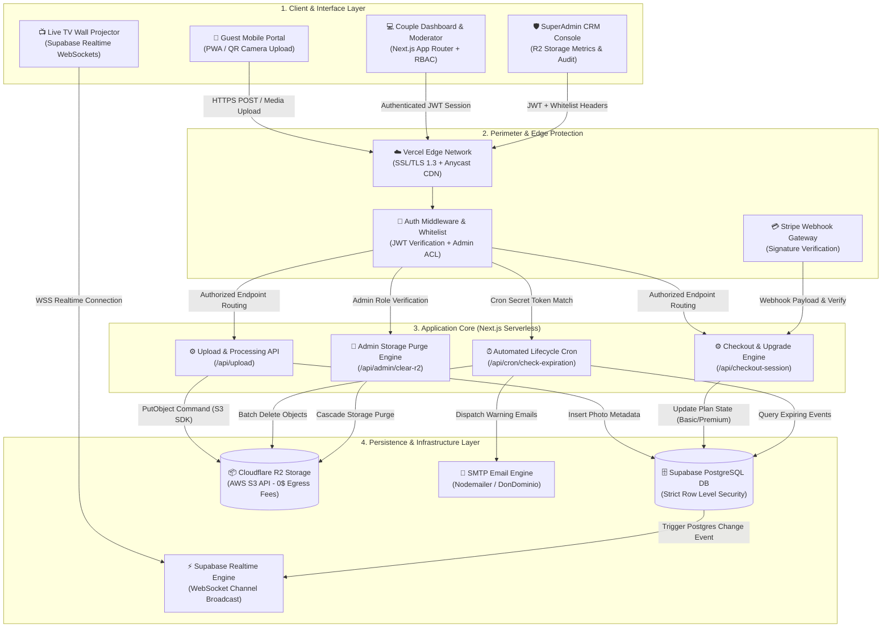
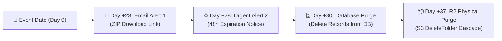

# 💍 Instabodas.es — Architectural Case Study & DevSecOps Showcase

> **Executive Summary**:  
> **Instabodas.es** is a high-availability, multi-tenant event media SaaS designed for real-time guest photo streaming, live TV projection, and full-lifecycle wedding planning. Built on a serverless event-driven architecture, it combines zero-egress cloud media storage with strict PostgreSQL Row-Level Security (RLS) and automated data lifecycle governance.

🌐 **Production Platform**: [instabodas.es](https://instabodas.es)

---

## 🎯 Technical Challenges & Core Objectives

Designing a digital platform for high-density live events presents unique engineering constraints: burst traffic spikes, zero guest friction, dynamic screen synchronization, and strict privacy regulations.

### 1. High-Burst Concurrency & Sub-Second Latency
* **Challenge**: Weddings create sudden traffic bursts (100–300+ guests uploading high-resolution media concurrently within a 3–5 hour window). Upload delays or lag on live TV projectors degrade user experience.
* **Architecture Solution**: Client-side media compression and metadata pre-validation paired with asynchronous chunked uploads directly to S3-compatible cloud storage. Live TV projection consumes low-overhead Supabase Realtime WebSocket notifications (`postgres_changes`), pushing new photo alerts to screens instantly without HTTP polling.

### 2. Multi-Tenant Isolation & Zero-Friction Privacy
* **Challenge**: Guests must upload photos and write guestbook messages via QR codes without friction (no app downloads or account registration), while ensuring complete multi-tenant data isolation and protection against malicious endpoint scanning.
* **Architecture Solution**: Cryptographic tenant routing using non-enumerable UUID v4 identifiers (`/boda/[weddingId]`). The persistence layer enforces strict PostgreSQL Row-Level Security (RLS) policies. Role-Based Access Control (RBAC) isolates couple administration, guest submissions, delegated moderator scopes (`?mod=[weddingId]`), and superadmin CRM operations.

### 3. Cost-Effective Infrastructure & Automated Data Governance
* **Challenge**: Storing gigabytes of uncompressed high-res images and zip archives per event risks rapid cloud egress cost inflation and long-term data retention liabilities under EU regulations.
* **Architecture Solution**: Decoupled cloud architecture using Next.js Serverless Route Handlers on Vercel Edge, relational persistence on Supabase PostgreSQL, and media storage on **Cloudflare R2** (eliminating AWS S3 egress bandwidth fees). An automated 2-stage Cron lifecycle engine handles automated email alerts, database purges at 30 days, and physical R2 object deletion at 37 days.

---

## 🏗️ System Architecture Diagram

The system operates across three decoupled layers: **Client & Edge Interface**, **Application & API Core**, and **Persistence & Storage Services**.

---

## 🛠️ Technical Decisions & Stack Justification

| Layer | Technology | Architectural Justification |
| :--- | :--- | :--- |
| **Framework** | **Next.js 16.2.7 (React 19)** | App Router architecture with Hybrid Server/Client Components. Fast server-side rendering for landing pages and light bundle payloads for mobile guests on limited cellular networks. |
| **Styling & UI** | **Tailwind CSS v4** | Zero-runtime CSS processing, fluid utility classes, and custom luxury theme system (`wedding-oro`, `wedding-eucalipto`, `wedding-crema`). |
| **Database & Auth** | **Supabase (PostgreSQL)** | Managed PostgreSQL with native **Row-Level Security (RLS)**, automated JWT handling, and WebSocket change data capture (`postgres_changes`) for real-time TV streaming. |
| **Media Storage** | **Cloudflare R2** | High-durability object storage using `@aws-sdk/client-s3`. Selected over AWS S3 to eliminate egress bandwidth costs entirely (0$ egress fees vs S3 transfer rates). |
| **Monetization** | **Stripe API** | Checkout Sessions, signature-verified Webhooks, and differential upgrade logic (upgrading Basic to Premium charges only the 20€ delta). Includes local sandbox simulation for unpaid tenants. |
| **Transactional Email** | **Nodemailer + SMTP** | Dedicated SMTP transport delivering lifecycle warnings, zip export notifications, and billing receipts directly from `info@instabodas.es`. |
| **QR Generation** | **QRServer Engine** | Error Correction Level H (High) enabling center logo/heart overlay without degrading QR scanning accuracy under variable lighting conditions. |

---

## 🛡️ Security Engineering & DevSecOps

### 1. Cryptographic Tenant Isolation
Every event workspace is instantiated with a non-enumerable PostgreSQL `UUID v4` generated via `gen_random_uuid()`. Because endpoints rely on 128-bit entropy, endpoint enumeration or brute-force crawling is mathematically infeasible.

### 2. Fine-Grained Row-Level Security (RLS) & RBAC
All PostgreSQL tables (`weddings`, `photos`, `invitados`, `mesas`, `gastos`) enforce mandatory RLS rules:
* **Anonymous Guest Access**: Restricted to `INSERT` and `SELECT` operations matching the specific `wedding_id` UUID payload.
* **Authenticated Couple Scope**: Full `SELECT`/`UPDATE` privileges restricted strictly to the user's authenticated UID.
* **Delegated Moderator Scope (`?mod=[weddingId]`)**: Restricts the UI layer to media moderation queues only, stripping access to settings, bank accounts, guest lists, and data export endpoints.
* **SuperAdmin Authorization**: API routes under `/api/admin/*` validate both the Supabase JWT and check the claims against a server-side administrator whitelist (`NEXT_PUBLIC_ADMIN_EMAILS`).

### 3. Automated Ephemeral Data Lifecycle (GDPR Compliance)
To prevent data leaks and maintain strict storage efficiency, the system implements an automated 30-day post-event data expiration pipeline:

* Executed daily via Vercel Cron (`GET /api/cron/check-expiration`).
* Requests must present a high-entropy secret token matching `CRON_SECRET`.
* Demo environments (e.g., `BodaLuciaAaron`) are explicitly exempt from automated purging.

### 4. Legal Compliance & Audit Logging (`consent_logs`)
Under the EU Consumer Rights Directive, immediate access to digital media services requires an explicit waiver of the standard 14-day right of withdrawal. The onboarding flow records an immutable audit entry in `consent_logs` storing user IP address, timestamp, terms version, and explicit checkbox consent state prior to Stripe checkout execution.

---

## 📋 Legal & Intellectual Property Notice

> **Notice**: This public showcase repository is published exclusively as a **technical architecture case study** to demonstrate software engineering standards, DevSecOps principles, and system design patterns.
> 
> The proprietary source code, internal business logic, production configuration secrets, and database schemas remain private property. All rights reserved under applicable copyright and commercial protection laws.

---

## 🏷️ Repository Metadata (For Technical Recruiters & SEO)

* **GitHub About Description**:
  `High-availability, privacy-first event media SaaS architecture case study with real-time WebSockets, R2 storage & DevSecOps.`
* **Topics / Tags**:
  `nextjs`, `react19`, `typescript`, `supabase`, `postgresql`, `cloudflare-r2`, `stripe-api`, `devsecops`, `software-architecture`, `realtime`, `system-design`, `gdpr-compliance`, `tailwind-css`, `saas-architecture`, `case-study`
